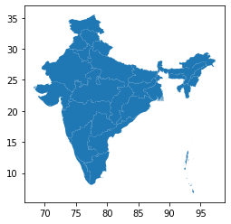
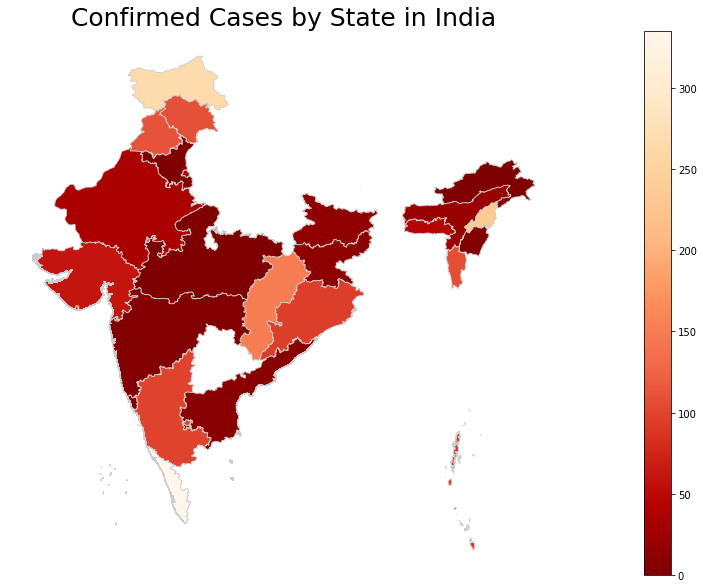

## <b>Statewise Data Analysis of COVID-19</b>

The Data is provided by <a href="">Adikansh Mittal's API</a> and the shapefiles are provided by <a href = "https://www.arcgis.com/home/user.html?user=planner_vijay_meena">Vijay Meena</a>. It provides a statewise visualisation of deaths. <br><br>
Geopandas on Windows using ```pip install geopandas``` might not work. You can follow <a href = "https://stackoverflow.com/questions/34427788/how-to-successfully-install-pyproj-and-geopandas">this</a> to sort that out. Since we are running on colab, it is not much of an issue, you can right away install it using ```pip install geopandas```.


```shell
pip install geopandas
pip install requests
pip install pandas
pip install matplotlib
```
```python
import requests
import geopandas as pd
import pandas as pd
import matplotlib.pyplot as plt
import json

url = "https://covid19-india-adhikansh.herokuapp.com/states"
response = requests.get(url)
response = response.json()
response = dict(response)
response = response["state"]
confirmed = []
for i in range(len(response)):
  del response[i]['_id']
  del response[i]['total']
  confirmed.append(response[i]['confirmed'])
#prettyPrintJSON = json.dumps(response, indent=2)
#print(prettyPrintJSON)
df = pd.DataFrame.from_dict(response)
print(df)
```

                               name  confirmed  cured  death
    0                Andhra Pradesh         86      1      1
    1   Andaman and Nicobar Islands         10      0      0
    2                         Assam          1      0      0
    3                         Bihar         23      0      1
    4                    Chandigarh         16      0      0
    5                  Chhattisgarh          9      2      0
    6                         Delhi        152      6      2
    7                           Goa          5      0      0
    8                       Gujarat         82      5      6
    9                       Haryana         43     21      0
    10             Himachal Pradesh          3      1      1
    11            Jammu and Kashmir         62      2      2
    12                    Jharkhand          1      0      0
    13                    Karnataka        110      9      3
    14                       Kerala        265     25      2
    15                       Ladakh         13      3      0
    16               Madhya Pradesh         99      0      6
    17                  Maharashtra        335     42     13
    18                      Manipur          1      0      0
    19                      Mizoram          1      0      0
    20                       Odisha          4      0      0
    21                   Puducherry          3      1      0
    22                       Punjab         46      1      4
    23                    Rajasthan        108      3      0
    24                   Tamil Nadu        234      6      1
    25                    Telengana         96      1      3
    26                  Uttarakhand          7      2      0
    27                Uttar Pradesh        113     14      2
    28                  West Bengal         37      6      3
    

Now that we have fetched the API and stored it in a variable, our next job is to fetch a SHX file and plot it via GeoPandas. To do this, you have to fetch your SHX file. You can download them for your country from <a href = "https://www.diva-gis.org/gdata">DIVA-GIS</a> (https://www.diva-gis.org/gdata).<br> 
If you are on colab, look to your left, there should be a hamburger icon. Click on it, and click on files (or file icon), and upload your .SHX there.


```python
fp = "IND_adm1.shx"
map_df = gpd.read_file(fp)
map_df.plot()
print(map_df)
```

                                                 geometry
    0   MULTIPOLYGON (((93.78773 6.85264, 93.78849 6.8...
    1   MULTIPOLYGON (((80.27458 13.45958, 80.27458 13...
    ....
    ....
    ....
   
    35  MULTIPOLYGON (((88.01861 21.57278, 88.01889 21...
    





```python
merged = map_df.join(df)
merged = merged.dropna()
merged = merged[['name', 'geometry', 'death', 'cured', 'confirmed']]
print(merged)
```

                               name  ... confirmed
    0                Andhra Pradesh  ...      86.0
    1   Andaman and Nicobar Islands  ...      10.0
    2                         Assam  ...       1.0
    3                         Bihar  ...      23.0
    4                    Chandigarh  ...      16.0
    5                  Chhattisgarh  ...       9.0
    6                         Delhi  ...     152.0
    7                           Goa  ...       5.0
    8                       Gujarat  ...      82.0
    9                       Haryana  ...      43.0
    10             Himachal Pradesh  ...       3.0
    11            Jammu and Kashmir  ...      62.0
    12                    Jharkhand  ...       1.0
    13                    Karnataka  ...     110.0
    14                       Kerala  ...     265.0
    15                       Ladakh  ...      13.0
    16               Madhya Pradesh  ...      99.0
    17                  Maharashtra  ...     335.0
    18                      Manipur  ...       1.0
    19                      Mizoram  ...       1.0
    20                       Odisha  ...       4.0
    21                   Puducherry  ...       3.0
    22                       Punjab  ...      46.0
    23                    Rajasthan  ...     108.0
    24                   Tamil Nadu  ...     234.0
    25                    Telengana  ...      96.0
    26                  Uttarakhand  ...       7.0
    27                Uttar Pradesh  ...     113.0
    28                  West Bengal  ...      37.0
    
    [29 rows x 5 columns]
    


```python
# set the value column that will be visualised
variable = 'confirmed'

# set the range for the choropleth values
vmin = 0
vmax = max(confirmed)

# create figure and axes for Matplotlib
fig, ax = plt.subplots(1, figsize=(30, 10))

# remove the axis
ax.axis('off')

# add a title and annotation
ax.set_title('Confirmed Cases by State in India', fontdict={'fontsize': '25', 'fontweight' : '3'})

# Create colorbar legend
sm = plt.cm.ScalarMappable(cmap='OrRd_r', norm=plt.Normalize(vmin=vmin, vmax=vmax))

# empty array for the data range
sm.set_array([]) # or alternatively sm._A = []. Not sure why this step is necessary, but many recommends it

# add the colorbar to the figure
fig.colorbar(sm)

# create map
merged.plot(column=variable, cmap='OrRd_r', linewidth=0.8, ax=ax, edgecolor='0.8')
```


    <matplotlib.axes._subplots.AxesSubplot at 0x7fde51e92ef0>





```python


```
